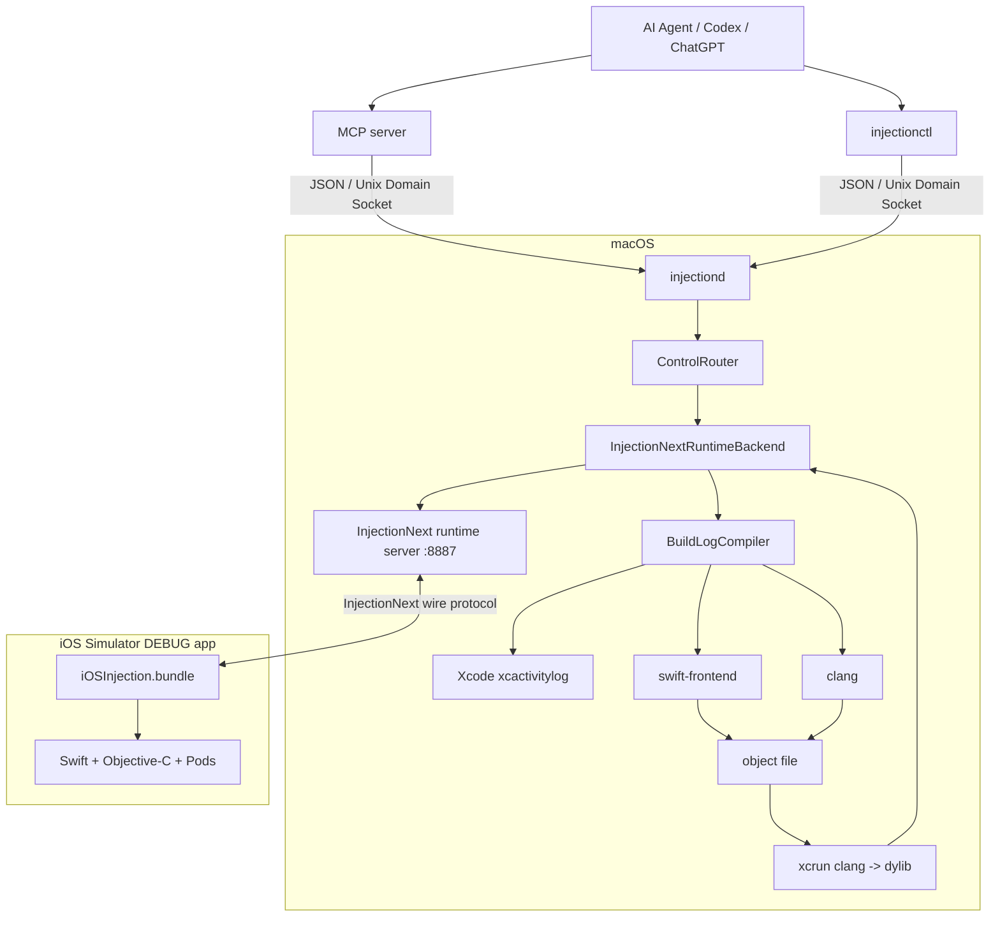

# AgentInjectionIII

Agent-first, headless code injection for iOS development.

> **Injection is explicit. Saving a source file records it as pending; an AI agent, the menu, CLI/MCP, or the Control + - hotkey decides when to inject.**

## Current status

The repository now has a real end-to-end headless path for iOS Simulator experiments:

```text
AI Agent
   |
   +--> MCP server
   |       |
   |       | JSON over Unix Domain Socket
   |       v
   +--> injectionctl
           |
           | JSON over Unix Domain Socket
           v
       injectiond
   |
   +--> BuildLogCompiler
   |      |
   |      +--> find original Xcode compile command
   |      +--> preserve CocoaPods / Swift / ObjC flags
   |      +--> compile one source file
   |      +--> link injection dylib
   |
   +--> InjectionNext-compatible runtime server
          |
          | TCP 127.0.0.1:8887
          v
      iOSInjection.bundle
          |
          v
      running Simulator app
```

There are two explicit trigger paths:

```text
Agent edits files
   -> Agent decides the edit is complete
   -> injectionctl inject Foo.swift Bar.m
   -> compile / link / inject

Developer saves files
   -> project watcher records pending source paths
   -> Control + - / menu / inject-pending
   -> compile / link / inject
```

The watcher never injects merely because a file was saved. It only records pending changes.

## What is implemented

- `injectionctl` JSON CLI
- `injectiond` long-running daemon
- `mcp-server` thin MCP adapter for AI agents
- Unix Domain Socket control plane
- InjectionNext-compatible runtime handshake (`INJECTION_VERSION=4001`)
- local Simulator runtime connection on TCP port `8887`
- explicit `load-dylib` command
- explicit `inject FILE...` command
- InjectionIII-style FSEvents project watcher with non-automatic pending changes
- `pending` / `inject-pending` CLI and MCP equivalents
- global `Control + -` manual injection shortcut
- structured `doctor [SOURCE]` diagnostics for Agent preflight
- Xcode `.xcactivitylog` lookup
- Swift single-file recompilation
- Objective-C / Objective-C++ single-file recompilation
- dylib linking
- runtime load/result reporting
- optional local runtime installation
- DEBUG-only project bootstrap that can coexist with teammates using InjectionIII.app
- screenshot capture
- UIKit touch capture / read / replay
- runtime logs and structured injection lifecycle events
- compiler interception / command capture
- SwiftTrace method tracing, profiling, call order and instance counts
- injected XCTest result observation
- source-order preview/apply helpers
- optional Xprobe / Eval bridge
- multiple runtime targets and explicit target selection

The build-log compiler is intentionally focused on normal Xcode/CocoaPods projects first. Bazel remains a later build-system phase. The physical-device path exists experimentally but the Simulator remains the validated development path.

## macOS app

AgentInjectionIII is packaged as a clickable menu bar application. The app owns the normal desktop lifecycle:

```text
AgentInjectionIII.app
        |
        +--> starts/monitors injectiond --enable-devices
        |
        +--> menu bar status + diagnostics
        |
        +--> Unix socket shared by MCP / injectionctl
        |
        +--> iPhone runtime connects to injectiond over the local network
```

Build the app bundle:

```bash
bash scripts/build-macos-app.sh
open dist/AgentInjectionIII.app
```

Or install it under `~/Applications`:

```bash
bash scripts/install-app.sh
open ~/Applications/AgentInjectionIII.app
```

The app is a menu-bar-only app (`LSUIElement`) and bundles its own `injectiond` helper. When the daemon is not reachable, the app starts it automatically with `--enable-devices`. Quitting AgentInjectionIII stops the daemon instance that the app owns.

For manual use without an AI agent:

1. Choose a project directory from the menu.
2. Edit and save Swift/Objective-C/Objective-C++ source files.
3. The watcher records those paths as pending without injecting automatically.
4. Press **Control + -** anywhere, or click **Inject Changed Files** in the menu.

Successful injections are removed from the pending list. Failed files remain pending for another attempt. Explicit Agent/MCP injections also clear successfully injected files so the manual shortcut does not inject them a second time.

For compatibility, existing state paths remain lowercase:

```text
/tmp/agentInjectionIII.sock
~/.agentInjectionIII/
```

Optional environment overrides are still supported:

```text
AGENT_INJECTION_SOCKET
AGENT_INJECTION_DAEMON
AGENT_INJECTION_PROJECT_ROOT
AGENT_INJECTION_DERIVED_DATA
AGENT_INJECTION_XCODE_PATH
```

## InjectionIII compatibility

AgentInjectionIII is intentionally opt-in per developer and does not replace InjectionIII for the rest of a team.

The Debug run script only embeds the Agent runtime when the current Mac has a local runtime under `~/.agentInjectionIII/runtime`. If that runtime is absent, `scripts/embed-runtime.sh` exits successfully without modifying the built app. The bootstrap then retains the classic fallback:

```text
embedded Agent iOSInjection.bundle present
        -> load AgentInjectionIII runtime

embedded Agent runtime absent
        -> try /Applications/InjectionIII.app/Contents/Resources/iOSInjection.bundle
```

Therefore a teammate who continues to run InjectionIII.app can use the same project, Podfile and Injection build settings without installing AgentInjectionIII. AgentInjectionIII's watcher, daemon, `Control + -` shortcut and Unix socket are separate from InjectionIII's watcher and historical `Control + =` shortcut.

The two desktop apps are not required to run simultaneously on the same Mac. The compatibility goal is that project integration remains non-destructive and each developer can choose their local workflow independently.

## Build

```bash
swift build
```

## Install the local iOS runtime

This builds InjectionNext's iOS Simulator injection bundle locally and installs it under your home directory:

```bash
bash scripts/install-runtime.sh
```

Default location:

```text
~/.agentInjectionIII/runtime/iOSInjection.bundle
```

The installer patches the local bundle with:

```text
INJECTION_HOST=127.0.0.1
INJECTION_NOSTANDALONE=1
```

`INJECTION_NOSTANDALONE=1` is important: if `injectiond` is unavailable, the runtime must not silently fall back to the classic save-and-auto-inject watcher.

## Integrate into an existing OC + Swift + CocoaPods app

No Podfile change is required.

### 1. Add the bootstrap

Copy:

```text
Integration/AgentInjectionBootstrap.h
Integration/AgentInjectionBootstrap.m
Integration/AgentTraceBridge.h
Integration/AgentTraceBridge.m
```

into the app target.

Call it during DEBUG startup:

```objc
#if DEBUG
[AgentInjectionBootstrap start];
#endif
```

The bootstrap behavior is:

```text
embedded iOSInjection.bundle exists
        -> load agent runtime

otherwise
        -> optionally fall back to /Applications/InjectionIII.app
```

This lets other developers keep their existing InjectionIII.app workflow.

### 2. Add an optional Debug Run Script phase

Use:

```bash
bash "${SRCROOT}/path/to/agentInjectionIII/scripts/embed-runtime.sh"
```

If `~/.agentInjectionIII/runtime/iOSInjection.bundle` does not exist, the script is a no-op. Therefore teammates who have not installed AgentInjectionIII are unaffected.

### 3. Keep the existing Injection build settings

The app's Debug target should still have the settings required by InjectionIII/InjectionNext, in particular:

```text
Other Linker Flags:
-Xlinker
-interposable
```

For modern Xcode Swift recompilation, also use:

```text
EMIT_FRONTEND_COMMAND_LINES = YES
COMPILATION_CACHE_ENABLE_CACHING = NO
```

The build-log path needs frontend commands to remain visible and does not support Xcode's compilation-cache `llvmcas://` command form.

If your team already uses InjectionIII successfully, some of these settings may already exist.

## Run

Start the daemon from the project repository root when possible:

```bash
swift run injectiond --project /absolute/path/to/YourProject
```

It exposes:

```text
control socket: /tmp/agentInjectionIII.sock
runtime TCP:    127.0.0.1:8887
```

Then launch the DEBUG app in Simulator.

Check connection:

```bash
swift run injectionctl status
```

When the runtime is connected, `backend.appConnected` should be true.

Before asking the Agent to inject, run the environment doctor:

```bash
swift run injectionctl doctor
```

To verify a particular source can be recovered from Xcode build logs without actually injecting it:

```bash
swift run injectionctl doctor \
  /absolute/path/Sources/FeedViewController.swift
```

The response contains structured `pass` / `warning` / `fail` checks for Xcode selection, project root, build logs, runtime connection/handshake, local runtime bundle, source existence, and compile-command discovery.

## Use from an AI Agent through MCP

The MCP server talks directly to the same Unix socket as `injectionctl`; it does not duplicate the compiler or injection implementation.

```bash
cd mcp-server
npm install
npm test
npm start
```

A typical MCP client configuration points Node at:

```text
/absolute/path/to/agentInjectionIII/mcp-server/index.js
```

The default daemon socket is `/tmp/agentInjectionIII.sock`. Override it with `AGENT_INJECTION_SOCKET` when needed.

The MCP surface includes injection, screenshots, touch replay, logs/events, compiler state, trace/profile, instance counts, test results, project reordering and optional Xprobe/Eval tools. See [mcp-server/README.md](mcp-server/README.md).

## Inject source explicitly

Swift:

```bash
swift run injectionctl inject \
  /absolute/path/Sources/FeedViewController.swift
```

Objective-C:

```bash
swift run injectionctl inject \
  /absolute/path/Sources/FeedViewController.m
```

Multiple files:

```bash
swift run injectionctl inject \
  /absolute/path/Foo.swift \
  /absolute/path/Bar.m
```

The daemon:

1. finds the most recent Xcode build log containing the source,
2. recovers the original compiler invocation,
3. keeps the project's real include/module/framework/bridging-header flags,
4. recompiles only that source,
5. links a dylib,
6. copies it into the connected Simulator app's temporary directory,
7. tells the InjectionNext runtime to load and patch it,
8. waits for `injected` / `failed`,
9. returns structured JSON to the agent.

## Screenshot verification

After the app runtime is connected:

```bash
swift run injectionctl screenshot /tmp/app.png
```

If the output path is omitted, the daemon writes a PNG under the system temporary directory and returns the generated path in JSON.

## Method-call tracing

The Agent trace bridge is enabled only when the embedded Agent runtime is loaded.

Start tracing the main app bundle:

```bash
swift run injectionctl trace start
```

Optionally apply a SwiftTrace include filter:

```bash
swift run injectionctl trace start 'FeedViewController|FeedService'
```

After exercising the app, consume buffered method-call events:

```bash
swift run injectionctl trace read 200
```

Stop tracing:

```bash
swift run injectionctl trace stop
```

`trace read` is consuming: returned events are removed from the daemon buffer so an Agent can poll incrementally without re-reading old calls.

The trace bridge uses a separate local TCP channel on `127.0.0.1:8888`. If a non-default daemon trace port is used, set the app scheme environment variable `AGENT_INJECTION_TRACE_PORT` to the same value.

## Low-level runtime test

If you already have a compatible injection dylib, bypass source compilation:

```bash
swift run injectionctl load-dylib /tmp/test-injection.dylib
```

This is useful for separating runtime transport problems from compiler problems.

## Example result

Success:

```json
{
  "ok": true,
  "injections": [
    {
      "file": "/repo/Sources/Foo.swift",
      "compiled": true,
      "injected": true,
      "compileMilliseconds": 312,
      "linkMilliseconds": 41,
      "message": "Runtime loaded and patched dylib."
    }
  ]
}
```

Compile failure:

```json
{
  "ok": false,
  "error": {
    "code": "COMPILE_FAILED",
    "message": "..."
  },
  "injections": [
    {
      "file": "/repo/Sources/Foo.swift",
      "compiled": false,
      "injected": false,
      "message": "..."
    }
  ]
}
```

## Architecture



## Why this works with CocoaPods

AgentInjectionIII does not reconstruct your project's compile flags from the Podfile.

Instead it reuses the command Xcode already used, preserving things such as:

- Header Search Paths
- Framework Search Paths
- module maps
- bridging headers
- CocoaPods defines
- SDK
- architecture
- Swift frontend flags

This is the same general strategy used by InjectionLite/InjectionNext.

## Current limitations

- Simulator is the validated path. Experimental real-device signing/transport code exists, but real-device validation is intentionally still pending.
- Build-log lookup requires a successful/recent Xcode build.
- Swift build-log injection requires `EMIT_FRONTEND_COMMAND_LINES=YES` on modern Xcode.
- The current path expects `COMPILATION_CACHE_ENABLE_CACHING=NO`.
- Whole-module compilation is not a good fit for single-file injection.
- Bazel is not connected yet.
- compiler commands are cached under `~/.agentInjectionIII/cache/compile-commands.json`; stale cached commands are invalidated and retried from recent build logs.
- missing Swift `-filelist` and stale bridging-header PCH paths have first-pass recovery, but still need validation against real-world Xcode/CocoaPods variants.
- screenshot and UIKit touch capture/read/replay are exposed through both `injectionctl` and MCP; touch replay is covered by the Simulator smoke workflow.
- trace streaming currently requires the DEBUG-only `AgentTraceBridge` files to be present in the app target and still needs end-to-end validation in a production CocoaPods app.
- CI is configured with Swift build/tests, MCP socket transport checks, and a mixed ObjC + Swift + CocoaPods Simulator injection smoke workflow.

## Roadmap

### Phase 1 — control plane

- [x] Swift Package layout
- [x] `injectionctl`
- [x] `injectiond`
- [x] Unix Domain Socket transport
- [x] structured JSON protocol
- [x] backend abstraction
- [x] MCP server over the existing Unix Socket control plane

### Phase 2 — headless injection

- [x] InjectionNext-compatible runtime TCP server
- [x] runtime handshake / platform / architecture / temp path
- [x] `load-dylib`
- [x] Xcode build-log compiler lookup
- [x] Swift source recompile path
- [x] ObjC / ObjC++ source recompile path
- [x] dylib link path
- [x] `inject FILE...` -> runtime load
- [x] structured `doctor [SOURCE]` preflight diagnostics
- [x] validate end-to-end against the mixed ObjC + Swift + CocoaPods Simulator smoke app
- [ ] validate against the target production CocoaPods app
- [x] persistent compiler-command cache
- [x] first-pass missing `-filelist` recovery
- [x] first-pass stale bridging-header PCH recovery
- [x] structured compiler diagnostics and compile/link timings
- [ ] validate parser edge cases against the target CocoaPods project

### Phase 3 — agent observability

- [x] injection lifecycle events
- [x] structured compiler diagnostics
- [x] trace start / read / stop control path
- [x] scoped trace / profile / call-order controls
- [x] SwiftTrace method-call side channel
- [x] lifetime instance counts
- [x] injected test-result observation
- [x] screenshot
- [x] UIKit touch capture / read / replay control path
- [x] Simulator touch replay -> live UIButton smoke validation
- [ ] validate trace/profile end-to-end in the target production app

### Phase 4 — devices / advanced build systems

- [x] experimental real-device signing and dylib transport implementation
- [ ] validate physical-device injection
- [ ] Bazel compiler lookup
- [x] multiple simultaneous app clients
- [x] target/client selection

## Upstream

The runtime wire protocol and build-log strategy are intentionally compatible with John Holdsworth's InjectionNext / InjectionLite projects.

See [THIRD_PARTY_NOTICES.md](THIRD_PARTY_NOTICES.md).

## License

No project-level license has been selected yet. Third-party components and derived ideas retain their upstream notices.
