# agentInjectionIII

Agent-first, headless code injection control plane for iOS development.

The project is being built around one rule:

> **An AI agent explicitly decides when code is injected. Saving a source file must not be the control API.**

## Current status

Phase 1 establishes the control plane:

```text
AI Agent
   |
   v
injectionctl
   |
   | JSON over Unix Domain Socket
   v
injectiond
   |
   v
InjectionBackend
   |
   +-- Phase 1: scaffold backend
   |
   +-- Next: InjectionNext compiler + InjectionServer backend
```

The first implementation intentionally does **not** pretend that injection is already wired. The CLI/daemon protocol is real; the backend reports that it is not ready until the InjectionNext engine is connected.

## Goals

- Headless operation. No menu-bar app required in the final architecture.
- Explicit agent-controlled injection: `injectionctl inject <files...>`.
- Structured JSON responses suitable for Codex/ChatGPT/other agents.
- Objective-C + Swift support by reusing the original Xcode compiler invocations.
- CocoaPods-friendly: do not reconstruct compiler flags by hand.
- A thin DEBUG-only client runtime in the target iOS app.
- Keep the control plane independent from the injection implementation.

## Architecture

```mermaid
flowchart LR
    Agent["AI Agent"] --> CLI["injectionctl"]
    CLI -->|"JSON / Unix domain socket"| Daemon["injectiond"]
    Daemon --> Router["ControlRouter"]
    Router --> Backend["InjectionBackend"]

    subgraph Future["Injection backend (next phase)"]
        Backend --> Engine["InjectionEngine"]
        Engine --> Compiler["NextCompiler / clang / swift-frontend"]
        Compiler --> Linker["dylib link + codesign"]
        Linker --> Server["InjectionServer"]
    end

    subgraph App["iOS DEBUG app"]
        Runtime["Injection client runtime"]
        Code["Objective-C + Swift app code"]
        Runtime --> Code
    end

    Server <-->|"injection protocol"| Runtime
```



## Commands

Build:

```bash
swift build
```

Run the daemon:

```bash
swift run injectiond
```

Check status:

```bash
swift run injectionctl status
```

Request injection:

```bash
swift run injectionctl inject /absolute/path/Foo.swift /absolute/path/Bar.m
```

The default socket is:

```text
/tmp/agentInjectionIII.sock
```

Override it with:

```bash
swift run injectiond --socket /tmp/my-injection.sock
swift run injectionctl --socket /tmp/my-injection.sock status
```

## Protocol

One newline-delimited JSON request per connection.

Example:

```json
{
  "id": "0C1A...",
  "action": "inject",
  "files": [
    "/repo/Sources/Foo.swift"
  ]
}
```

Response:

```json
{
  "id": "0C1A...",
  "ok": false,
  "error": {
    "code": "BACKEND_NOT_READY",
    "message": "Injection engine is not connected yet."
  }
}
```

## Implementation roadmap

### Phase 1 — control plane

- [x] Swift Package layout
- [x] `injectionctl`
- [x] `injectiond`
- [x] Unix Domain Socket transport
- [x] JSON request/response protocol
- [x] `status`
- [x] `inject <files...>` request path
- [x] backend abstraction
- [ ] CI build verification

### Phase 2 — real InjectionNext backend

Extract/reuse the backend path that currently ends at:

```text
InjectionHybrid
  -> compiler selection
  -> NextCompiler.inject(source:)
  -> recompile
  -> link dylib
  -> codesign
  -> InjectionServer
  -> client runtime
```

The important refactor is to make the trigger:

```text
CLI command -> InjectionEngine.inject(files)
```

instead of:

```text
FileWatcher -> InjectionHybrid.inject(source)
```

### Phase 3 — DEBUG app runtime integration

Support a thin project-side bootstrap that can coexist with teammates using InjectionIII.app.

Target shape:

```text
Shared project
   |
   +-- normal teammate -> InjectionIII.app
   |
   +-- agent mode -> embedded client runtime -> injectiond
```

No Podfile changes should be required for the initial integration.

### Phase 4 — agent observability

- trace / untrace
- compiler diagnostics
- structured injection events: detecting / compiled / injected / failed
- screenshots
- touch record/replay
- method-call traces

## Upstream direction

The backend design is intentionally aligned with InjectionNext's existing implementation, especially its `NextCompiler.inject(source:)`, compiler invocation cache, `InjectionServer`, and Unix-socket control ideas. We will reuse/refactor those concepts rather than inventing a second injection engine.

## License

License is intentionally not selected yet. Before copying or redistributing upstream implementation code, confirm and preserve the applicable upstream license and notices.
