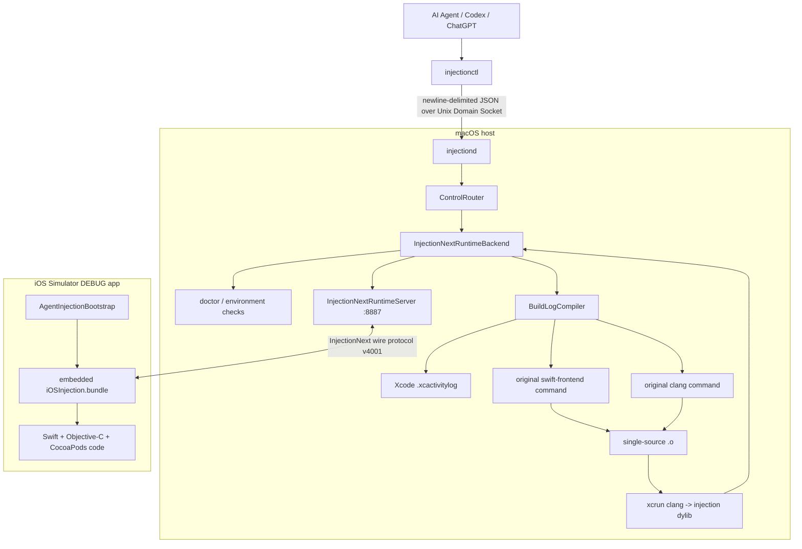

# Architecture

## Current architecture



## Trigger model

The defining design choice is that an Agent command, not a file-system event,
owns the injection lifecycle.

Classic human hot reload:

```text
save source
  -> watcher
  -> compile
  -> inject
```

agentInjectionIII:

```text
agent edits A.swift / B.m
  -> agent finishes the logical change
  -> injectionctl doctor A.swift
  -> injectionctl inject A.swift B.m
  -> compile / link / inject
  -> structured JSON result
  -> later: screenshot / trace / verify
```

A watcher can exist later as an optional human frontend, but it is not part of
the Agent control API.

## Process boundary

`injectionctl` is intentionally stateless:

```text
request -> JSON response -> exit
```

`injectiond` owns long-lived state:

- the Unix control socket
- the connected app runtime
- runtime platform / architecture / temporary path
- recovered compiler command cache
- future trace / screenshot sessions

This makes the command line safe for an Agent to call repeatedly without losing
runtime state.

## Control protocol

Current actions:

```text
status
doctor [SOURCE]
inject FILE [FILE ...]
load_dylib DYLIB
```

The backend boundary is:

```swift
protocol InjectionBackend {
    var name: String { get }

    func status() -> BackendStatus
    func doctor(path: String?) -> DoctorReport
    func inject(files: [String]) -> BackendInjectionResponse
    func loadDylib(path: String) -> BackendInjectionResponse
}
```

## Source compilation

For an Objective-C + Swift + CocoaPods application, reconstructing compiler
arguments from the Podfile would be too fragile.

Instead `BuildLogCompiler` searches Xcode's existing `.xcactivitylog` files
and recovers the command Xcode already used for the requested source.

That preserves the real target context:

- Header Search Paths
- Framework Search Paths
- module maps
- bridging headers
- CocoaPods defines
- SDK
- architecture / target triple
- Swift frontend flags

The recovered command is reduced to one requested source and a temporary
object file. That object is linked into a dynamic library and handed to the
runtime.

Required Debug settings for the current log path:

```text
-Xlinker -interposable
EMIT_FRONTEND_COMMAND_LINES = YES
COMPILATION_CACHE_ENABLE_CACHING = NO
```

## Runtime boundary

The current Agent runtime deliberately uses the InjectionNext client protocol:

```text
iOSInjection.bundle
    |
    | TCP 127.0.0.1:8887
    |
InjectionNextRuntimeServer
```

Handshake metadata includes:

```text
protocol version 4001
platform
architecture
runtime temporary directory
```

For Simulator injection, the daemon copies the produced dylib into the
runtime's temporary directory, sends the `load` command, and waits for the
runtime's `injected` / `failed` response.

## Project integration and team coexistence

The shared application contains a very small DEBUG bootstrap:

```text
AgentInjectionBootstrap
       |
       +-- embedded iOSInjection.bundle exists
       |       -> Agent/headless runtime
       |
       +-- embedded bundle absent
               -> /Applications/InjectionIII.app/.../iOSInjection.bundle
```

The local bundle is copied by `scripts/embed-runtime.sh` only when installed
under the developer's home directory, so there is no conditional Podfile and no
`Podfile.lock` difference.

This lets the Agent-enabled developer use:

```text
Agent -> injectionctl -> injectiond
```

while teammates keep:

```text
Developer -> InjectionIII.app
```

from the same Xcode project.

## Why not directly reuse an arbitrary classic InjectionIII bundle?

The classic InjectionIII/HotReloading protocol differs from InjectionNext and
InjectionIII builds generate a matching injection salt as part of the app/bundle
build. A generic headless server therefore cannot reliably assume that any
random prebuilt InjectionIII bundle has the same handshake values.

For now the Agent path builds and patches a known InjectionNext-compatible
runtime locally with `scripts/install-runtime.sh`, while the fallback remains
available for teammates using InjectionIII.app.

## Doctor

`injectionctl doctor` is intended as the Agent's preflight.

It checks:

- selected Xcode developer directory
- configured project root
- available Xcode build logs
- runtime connection
- runtime handshake metadata
- locally installed runtime bundle

When a source is supplied, it also checks:

- source path exists
- a matching Xcode compiler command can be recovered

This separates environment/setup failures from actual compiler or runtime
injection failures.

## Next boundaries

The next high-value layers are:

```text
structured compiler diagnostics
injection lifecycle event stream
trace / untrace + method-call output
screenshot
touch record / replay
persistent compiler command cache
multiple runtime clients / target selection
device signing and transport
```
