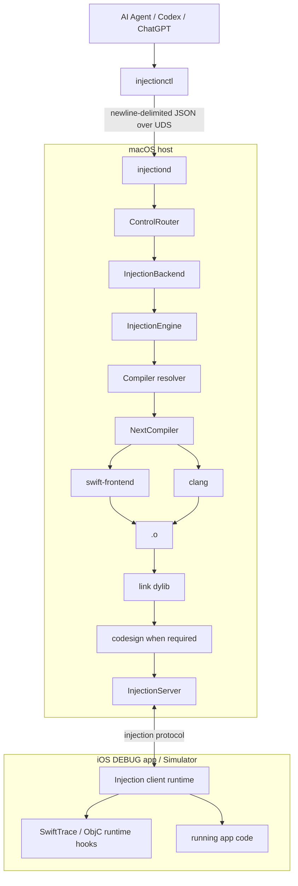

# Architecture

## Target architecture



## Trigger model

The important design change from classic hot reload is the trigger.

Human hot reload:

```text
file save
  -> watcher
  -> compile
  -> inject
```

Agent mode:

```text
agent edits one or more files
  -> agent decides the edit is complete
  -> injectionctl inject A.swift B.m
  -> compile
  -> inject
  -> structured result
  -> screenshot / trace / verify
```

A watcher may be added later as an optional human convenience. It is not the control API.

## Control-plane boundary

`injectionctl` is intentionally stateless. It sends one request and exits.

`injectiond` owns long-lived state:

- compiler invocation cache
- connected app runtime
- injection sequence numbers
- link settings
- logs and diagnostics
- future trace sessions

This separation makes the CLI easy for agents to invoke while keeping the injection engine stateful.

## Backend boundary

Phase 1 defines:

```swift
protocol InjectionBackend {
    var name: String { get }
    func status() -> BackendStatus
    func inject(files: [String]) -> BackendInjectionResponse
}
```

The initial implementation is a scaffold. The real backend should reuse/refactor InjectionNext around:

```text
compiler invocation capture
  -> compiler selection
  -> NextCompiler.inject(source:)
  -> recompile
  -> link
  -> codesign
  -> InjectionServer
```

## CocoaPods projects

For Objective-C + Swift projects using CocoaPods, the daemon must **reuse the original Xcode compiler invocation**. It must not construct `swiftc` or `clang` arguments from scratch.

That preserves:

- Header Search Paths
- Framework Search Paths
- module maps
- bridging headers
- CocoaPods defines
- target architecture
- SDK
- Swift flags
- linker inputs

## Project-side runtime

The final target app integration should remain thin and DEBUG-only:

```text
App launch
  -> load AgentInjection runtime/bundle
  -> runtime connects to injectiond
  -> receive dylib
  -> dlopen / symbol rebinding
```

It should be possible for teammates to continue using InjectionIII.app while agent-enabled developers use the embedded runtime.
