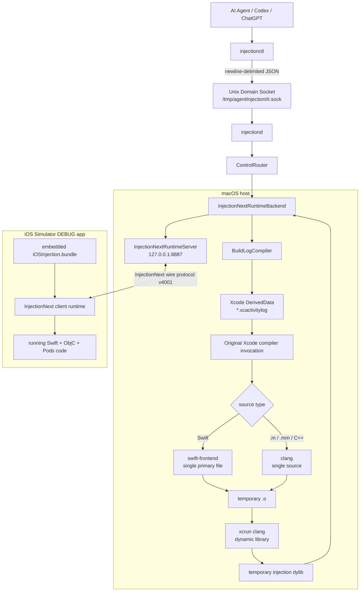
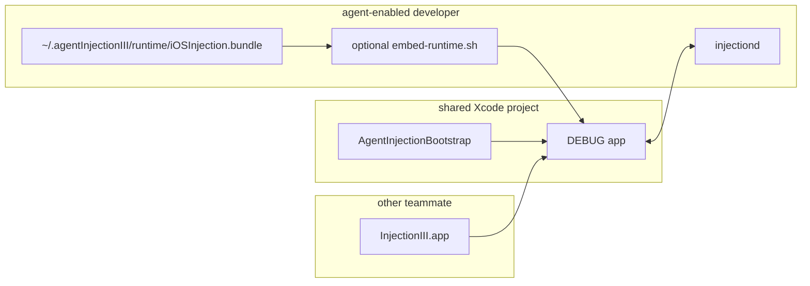

# agentInjectionIII architecture

## Current execution path



## Design rule: command-triggered, not file-triggered

Classic InjectionIII / InjectionNext human workflow:

```text
save file
  -> FileWatcher
  -> recompile
  -> inject
```

agentInjectionIII:

```text
Agent edits A.swift
Agent edits B.m
Agent finishes the logical change
  -> injectionctl inject A.swift B.m
  -> compile
  -> inject
  -> structured result
  -> Agent verifies
```

The daemon intentionally does not watch source files.

## Process boundaries

### injectionctl

Short-lived and stateless.

Responsibilities:

- normalize CLI input
- send one JSON request
- print one structured JSON response
- return a meaningful exit code

### injectiond

Long-lived and stateful.

Responsibilities:

- keep the Unix control socket open
- keep the InjectionNext runtime connection open
- retain compiler-command cache
- serialize runtime injection operations
- compile/link changed sources
- return machine-readable results

### iOSInjection.bundle

DEBUG-only runtime loaded inside the Simulator app.

Responsibilities:

- connect to the headless Mac server
- receive a dylib path
- dlopen / patch symbols using InjectionNext's runtime
- report `injected`, `failed`, or `unhide`

It is locally installed and optionally embedded so the app's Podfile does not change.

## Runtime protocol

The headless runtime server implements the subset of InjectionNext's protocol required for source injection.

```text
TCP 127.0.0.1:8887

client -> server
  Int32 4001
  String validation key

server -> client
  command xcodePath

client -> server
  platform + arch
  tmpPath
  optional project metadata

server -> client
  load <dylib path>

client -> server
  injected | failed | unhide
```

The Simulator and macOS host share the CoreSimulator filesystem, so the daemon can copy a dylib into the temporary directory reported by the client and send the `load` command.

## Compiler strategy

The compiler does **not** reconstruct build flags from CocoaPods.

Instead:

```text
source path
   |
   v
scan recent DerivedData Logs/Build/*.xcactivitylog
   |
   v
find the exact Xcode compiler command that built the source
   |
   v
rewrite only what is necessary for one-file compilation
```

This preserves project-specific state such as:

- Header Search Paths
- Framework Search Paths
- module maps
- bridging headers / PCH references
- CocoaPods macros
- SDK selection
- target triples
- Swift frontend options

### Swift rewriting

The compiler:

- preserves the requested `-primary-file`
- removes other primary files
- replaces the original `-o`
- changes `-emit-object` to `-c`
- strips per-primary output/index/diagnostic options
- retains the target's original module/search-path flags
- adds `DEBUG` and `INJECTING`

When a historical `-filelist` has been deleted, it attempts to reconstruct it from the build log's `-output-file-map`.

When a stale bridging-header PCH path is detected, it attempts the same recovery strategy used by InjectionLite: locate the most recent compatible PCH, symlink the historical path, and retry once.

### Objective-C / Objective-C++

The original clang invocation is retained and only the old output path is replaced. Injection adds:

```text
-DDEBUG
-DINJECTING
-Xclang -fno-validate-pch
```

## Link strategy

The generated object is linked as a dynamic library using the runtime platform:

```text
iPhoneSimulator -> xcrun --sdk iphonesimulator clang
iPhoneOS        -> xcrun --sdk iphoneos clang
...
```

The linker uses:

- the explicit SDK sysroot
- the original target triple when available
- `-undefined dynamic_lookup`
- `-interposable`
- Swift runtime search/rpath support

Simulator is the first supported target. Device signing is a later phase.

## Project integration



If the local runtime is not installed, `embed-runtime.sh` is a no-op. The bootstrap can then fall back to the team's existing InjectionIII.app bundle.

No Podfile modification is required.

## Failure taxonomy

Errors are designed for agents to branch on programmatically.

### Control plane

```text
DAEMON_UNAVAILABLE
INVALID_REQUEST
MISSING_FILES
MISSING_PATH
```

### Runtime

```text
RUNTIME_NOT_CONNECTED
RUNTIME_HANDSHAKE_INCOMPLETE
RUNTIME_VERSION_MISMATCH
RUNTIME_KEY_REJECTED
RUNTIME_*_FAILED
DYLIB_INJECTION_FAILED
```

Typical action:

```text
RUNTIME_NOT_CONNECTED
  -> launch/relaunch DEBUG app
  -> status
  -> retry
```

### Compilation

```text
SOURCE_NOT_FOUND
UNSUPPORTED_SOURCE
COMPILE_COMMAND_NOT_FOUND
FILELIST_MISSING
COMPILE_FAILED
```

Typical action:

```text
COMPILE_COMMAND_NOT_FOUND / FILELIST_MISSING
  -> perform a normal Xcode Debug build
  -> retry

COMPILE_FAILED
  -> inspect compiler output
  -> fix source
  -> retry injection
```

### Link

```text
LINK_FAILED
```

Typical action:

- inspect SDK / target / unresolved-link diagnostics
- fix link strategy or project settings
- do not restart the app unless runtime state is also invalid

## Current validation layers

The repository contains:

1. control-router unit tests,
2. compiler command-rewrite regression tests,
3. a fake InjectionNext TCP client integration test that validates:
   - version/key handshake,
   - xcodePath command,
   - platform/arch reporting,
   - tmpPath reporting,
   - dylib copy + load command,
   - injected response.

A real CocoaPods app/Simulator validation is still required before calling the end-to-end path production-ready.

## Next architecture work

The next high-value additions are:

- persistent compiler-command cache,
- structured compiler diagnostics instead of one large error string,
- injection lifecycle events (`detecting / compiling / linked / injecting / injected / failed`),
- trace/untrace and method-call stream,
- screenshots and touch record/replay,
- multi-client selection,
- real-device signing/transport.
